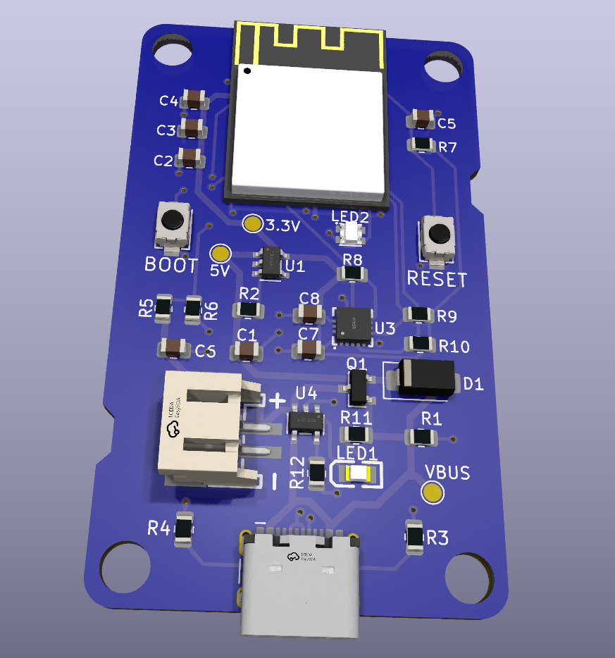
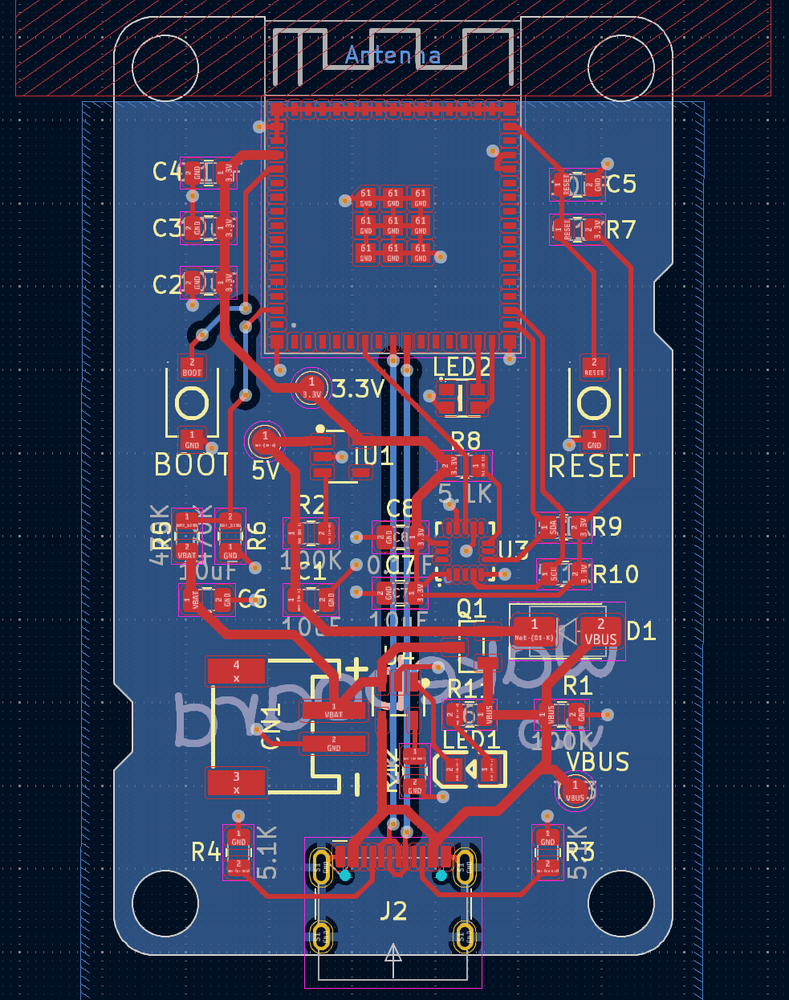

# Wakeboard

A custom Kicad PCB based on the ESP32 and LIS3DH accelerometer. I built this to use as a low power device to detect when my washing machine starts and to send me a notification when it ends.

All files are open source under the Apache Licence 2.0







## Instructions for adding components

Since I wanted to order the PCB with JLCPCB, I wanted to ensure I picked parts that they have in stock. To do this, I used [easyeda2kicad](https://github.com/uPesy/easyeda2kicad.py) to pull the schematic, footprint and 3D model of a given LCSC part number. To run the script:

```
pip install easyeda2kicad
```

```
easyeda2kicad --full --lcsc_id=C2894897
```

This will copy files from EasyEDA (JLCPCB's own PCB creation tool) and save them into your `Documents/Kicad` directory.

From here, you can add this location as a library into KiCad to make all your downloaded components available:

* In KiCad, Go to Preferences > Configure Paths, and add the environment variables EASYEDA2KICAD :

    Windows : C:/Users/your_username/Documents/Kicad/easyeda2kicad/,
    Linux : /home/your_username/Documents/Kicad/easyeda2kicad/

* Go to Preferences > Manage Symbol Libraries, and Add the global library easyeda2kicad : ${EASYEDA2KICAD}/easyeda2kicad.kicad_sym
* Go to Preferences > Manage Footprint Libraries, and Add the global library easyeda2kicad : ${EASYEDA2KICAD}/easyeda2kicad.pretty

